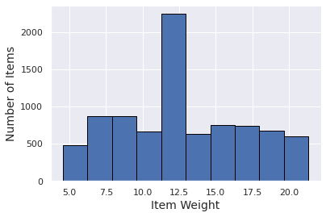
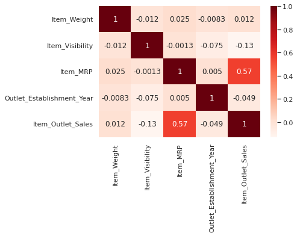

# Manufacturers Outlet Sales Predctions

*Model creation to provide predictions and data visualizations of item sales per Manufacturers Outlet.*

Author: **Christopher Puccetti**

**Business Problem:**

Being provided with the data, we had to clean up unecessary data to provide our clientele with proper data visualizations and accurate sales predictions so our clientele can understand how their items will sell.

**Methods**

The data set that we were provided, like stated above, was missing some key values that could have played a vital role in our data mode. All of the missing values in the Item Weight column was imputed with the average mean of the total values. Reason to fill in with the average of the provided data was so that we could provide a more accurate model prediction. The amount of missing values for our Item Weight column was less than twenty percent, so filling in with the average would not skew our results. When it came to our Outlet Size column, we filled all of our missing values with the previous rows values.

**Results**

*Histogram of total weight of items*

According to the image above, this histogram shows the minimum and maximum weight of the provided items in the dataset. More items have a weight between ~11-12 lbs.

*Correlation heatmap of provided data*

The above heatmap shows the correlation between all the provided data and their counterparts. There is a moderate correlation between Item MRP and Item Outlet Sales.

**Model**

Based on the models that we have ran, we would recommend using the our Regression Tree model. The regression tree model, although takes a little longer to get to our desired outcome, provides us with more accurate values when presenting to our clientele.

**Recommendations**

In future expansions of outlets, clientele should focus on low fat items as a healthier choice. 

**Limitations & Next Steps**

Data provided is somewhat scarce, having more values in the dataset could result in improved predictions. Having this information provided could give Manufacturers a better grasp how well their items sell in their outlets. To move forward, we could contact clients and dive deeper and work together to achieve better results. 

**Contact Information**

Additional questions, reach me at:
* E-mail: villager.2855@gmail.com
* LinkedIn: linkedin.com/in/chris-puccetti

